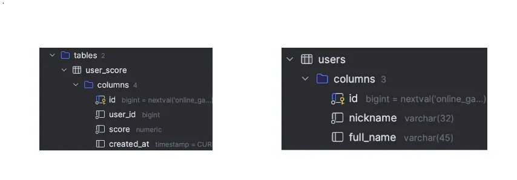
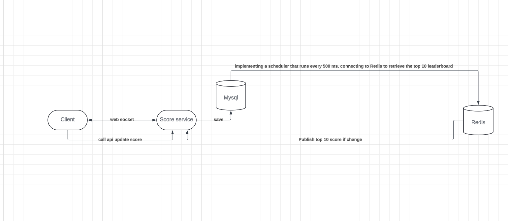

  <a href="" rel="noopener">

<h3 align="center">Problem6</h3>

---

 This module is responsible for handling requests related to updating and retrieving user scores for the scoreboard feature on the website. It ensures real-time updates of the top 10 user scores and implements security measures to prevent unauthorized score increases.
      

## 📝 Table of Contents

- [Problem Statement](#problem_statement)
- [Idea / Solution](#idea)

## 🧐 Problem Statement 

- Score Board Display: The module should display the top 10 user scores on the website.
- Real-time Updates: The score board should be updated in real-time.
- User Action: The user can perform an action (the nature of which is not specified) to increase their score.
- API Call: Upon completion of the user action, an API call is dispatched to the application server to update the score.
- Score Increase: Only one score increase per user action is allowed. Subsequent actions will be ignored.
- Security: Measures should be in place to prevent malicious users from unauthorized score increases.
  It is useful to design and follow a specific format when writing a problem statement. While there are several options

## 💡 Idea / Solution 

Idea:

- Set up the database and the user_score_transactions table:
  This table will store the history of user scores.
- Throttling mechanism:
  Set up a cache and throttling duration (e.g., 500 milliseconds) to control the frequency of score updates.
- Update Redis Sorted Set and database query
  Update the Redis Sorted Set with the top 10 users' scores.
  Provide an API to retrieve the top 10 users' scores from Redis.
  Send the updated information to clients via WebSocket.

Scoreboard API Service:

- GET /scores: Retrieves the top 10 user scores.
- POST /scores/update: Updates a user's score upon completion of an action. Only users with valid authentication tokens.
- WSS /realtime-top-10-user-scores: Retrieves the top 10 user scores.

Database Design

- Create 2 table users and user_score_transactions.
- Use sorted set save data in redis.

  

Flow of Execution:

1. The client application triggers an action (e.g., completing a task).
2. Upon completion of the action, the client application sends a POST request to the /scores/update endpoint of the API service, including the user's authentication token, nonce and the updated score.
3. Insert data to user_score_transactions.
4. Implement throttling and caching mechanisms to manage and control the frequency of user’s score updates effectively.
   I’ll establish a throttle duration, such as 500 ms (you can adjust it based on your need)(we need to execute a query which is mentioned `select user_id, sum(score) as sum
from user_score
group by user_id
order by sum desc
limit 10` to calculate score for each user).
5. Send realtime data to clients via Websocket.

## 🎉 Diagram 

## ⛏️ Built With 

- [Mysql](https://www.mysql.com/) - Database
- [Express](https://expressjs.com/) - Server Framework
- [VueJs](https://vuejs.org/) - Web Framework
- [NodeJs](https://nodejs.org/en/) - Server Environment
- [Redis](https://redis.io/) - Cache

## ✍️ Authors 

- [@thangpdt2000](https://github.com/thangpdt2000s) - Idea & Initial work
